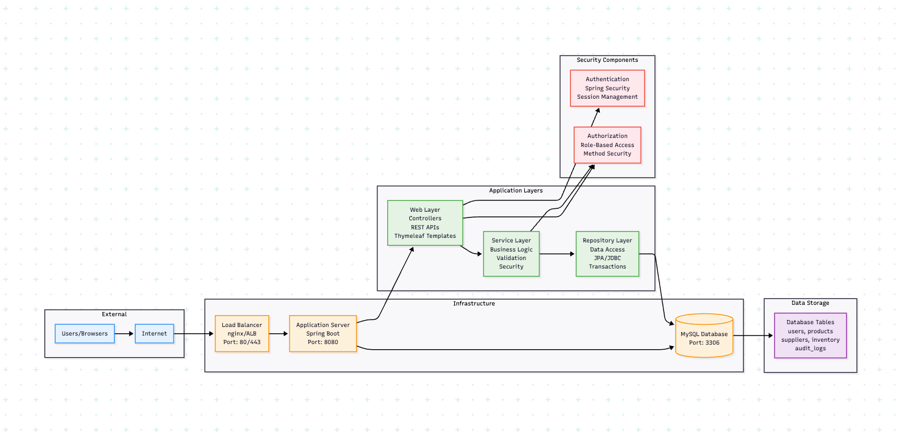

# Architecture Overview - Java Inventory Service

## System Context
The Java Inventory Service is a Spring Boot web application designed for SecureShop Inc. to manage product inventory, suppliers, and user access. The system follows a traditional three-tier architecture with a web frontend, business logic layer, and MySQL database backend.




## High-Level Components

### 1. Web Layer (Presentation Tier)
- **Spring MVC Controllers**: Handle HTTP requests and responses
- **Thymeleaf Templates**: Server-side rendering for web pages
- **REST API Endpoints**: JSON-based API for mobile/external clients
- **Static Resources**: CSS, JavaScript, and image assets

### 2. Business Logic Layer (Service Tier)
- **Service Classes**: Core business logic implementation
- **Repository Layer**: Data access abstraction using Spring Data JPA
- **Security Configuration**: Spring Security for authentication/authorization
- **Validation Layer**: Input validation and business rule enforcement

### 3. Data Layer (Persistence Tier)
- **MySQL Database**: Primary data storage
- **JPA Entities**: Object-relational mapping
- **Connection Pooling**: HikariCP for database connection management
- **Database Migrations**: Flyway for schema versioning

## Data Flow Architecture


### Request Processing Flow
1. **HTTP Request** → Web Controller
2. **Controller** → Service Layer (business logic)
3. **Service** → Repository (data access)
4. **Repository** → Database (SQL queries)
5. **Database** → Repository (result sets)
6. **Repository** → Service (domain objects)
7. **Service** → Controller (processed data)
8. **Controller** → HTTP Response

## Trust Boundaries

### External Trust Boundary
- **Internet** ↔ **Load Balancer/Reverse Proxy**
- All external traffic must pass through authentication
- HTTPS termination at the edge

### Application Trust Boundary
- **Web Layer** ↔ **Service Layer**
- Input validation occurs at controller level
- Authorization checks in service methods

### Data Trust Boundary
- **Service Layer** ↔ **Database**
- Database credentials stored in environment variables
- Connection encryption with TLS

## Network Architecture

```
┌─────────────────┐    ┌─────────────────┐    ┌─────────────────┐
│   Load Balancer │    │  Application    │    │    Database     │
│   (nginx/ALB)   │◄──►│   Server        │◄──►│    (MySQL)      │
│   Port: 80/443  │    │   Port: 8080    │    │   Port: 3306    │
└─────────────────┘    └─────────────────┘    └─────────────────┘
```

### Network Segmentation
- **DMZ**: Load balancer and reverse proxy
- **Application Tier**: Spring Boot application servers
- **Database Tier**: MySQL database with restricted access

## Security Architecture

### Authentication Flow
1. User submits credentials via login form
2. Spring Security validates against database
3. Successful authentication creates session
4. Session ID stored in HTTP-only cookie
5. Subsequent requests validated against session store

### Authorization Model
- **Role-Based Access Control (RBAC)**
- Roles: ADMIN, MANAGER, EMPLOYEE, VIEWER
- Permissions mapped to specific operations
- Method-level security annotations

## Component Dependencies

### External Dependencies
- **Spring Boot 2.7.x**: Application framework
- **Spring Security 5.7.x**: Authentication/authorization
- **Spring Data JPA 2.7.x**: Data access layer
- **MySQL Connector 8.0.x**: Database driver
- **Thymeleaf 3.0.x**: Template engine
- **HikariCP 5.0.x**: Connection pooling

### Internal Components
```
┌─────────────────┐
│   Controllers   │
├─────────────────┤
│    Services     │
├─────────────────┤
│  Repositories   │
├─────────────────┤
│   Entities      │
└─────────────────┘
```

## Database Schema

### Core Tables
- **users**: User accounts and authentication data
- **products**: Product catalog information
- **suppliers**: Supplier contact and business data
- **inventory**: Stock levels and warehouse locations
- **audit_logs**: Security and business event logging

### Relationships
- Users → Audit Logs (1:N)
- Suppliers → Products (1:N)
- Products → Inventory (1:N)

## Deployment Architecture

### Local Development
- Embedded Tomcat server
- H2 in-memory database (optional)
- Hot reload with Spring Boot DevTools

### Production Environment
- Containerized deployment with Docker
- External MySQL database
- Redis for session storage (optional)
- Application monitoring with Micrometer

## Security Considerations

### Current Security Controls
- HTTPS enforcement
- CSRF protection enabled
- XSS protection headers
- Session timeout configuration
- Password hashing with BCrypt

### Known Vulnerabilities (Intentional)
- SQL injection in search functionality
- Insufficient input validation
- Verbose error messages
- Missing authorization checks
- Weak session management

## Monitoring and Logging

### Application Logs
- Request/response logging
- Authentication events
- Business transaction logs
- Error and exception tracking

### Security Logs
- Failed login attempts
- Privilege escalation attempts
- Suspicious query patterns
- Data access violations

## Scalability Considerations

### Horizontal Scaling
- Stateless application design
- External session storage
- Database connection pooling
- Load balancer configuration

### Performance Optimization
- Database query optimization
- Caching strategies
- Connection pool tuning
- Static resource optimization

## Research Assignments

1. **Spring Security Architecture**: Research how Spring Security's filter chain works and identify potential bypass techniques.

2. **JPA Security**: Investigate how JPA/Hibernate handles dynamic queries and the security implications of different query construction methods.

3. **Database Security**: Study MySQL security best practices including user privileges, network security, and audit logging.

4. **Container Security**: Research Docker security best practices for Java applications, including image scanning and runtime protection.


The Java Inventory Service is a Spring Boot web application designed for SecureShop Inc. to manage product inventory, suppliers, and user access. The system follows a traditional three-tier architecture with a web frontend, business logic layer, and MySQL database backend.

1. The application is internet facing. 
2. The application intended users are nurse practitioners
3. The application internal services communicates over plain text HTTP Protocol

- Connecting to third party services with out any authentication
- There is not WAF for the service

- HTTPS for users
- RBAC implemented

- Use of HTTP protocol might be subject to information disclosure. Consider using HTTP with TLS 1.2
- Use of FTP protocol for file transfer. FTP has larger threat surface and does not use secure channel unless enabled explicitly. 