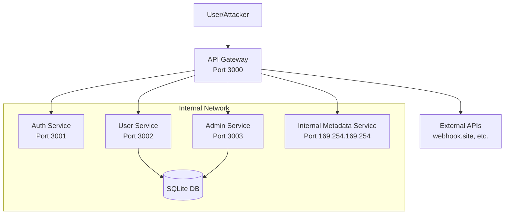

# API Gateway Architecture - Lab 03

## Overview

This lab implements a Node.js API Gateway that demonstrates Server-Side Request Forgery (SSRF) vulnerabilities. The architecture simulates a microservices environment where the gateway routes requests to internal services.

## System Architecture



## Components

### 1. API Gateway (Port 3000)
- **Technology**: Express.js
- **Purpose**: Routes requests to backend services
- **Vulnerabilities**: 
  - SSRF in webhook functionality
  - SSRF in URL fetching endpoints
  - SSRF in proxy endpoints

### 2. Auth Service (Port 3001)
- **Technology**: Express.js
- **Purpose**: Handles authentication
- **Endpoints**:
  - `POST /auth/login`
  - `GET /auth/verify`

### 3. User Service (Port 3002)
- **Technology**: Express.js
- **Purpose**: Manages user data
- **Endpoints**:
  - `GET /users`
  - `POST /users`
  - `GET /users/:id`

### 4. Admin Service (Port 3003)
- **Technology**: Express.js
- **Purpose**: Administrative functions (internal only)
- **Endpoints**:
  - `GET /admin/stats`
  - `GET /admin/config`
  - `DELETE /admin/users/:id`

## Security Issues

### SSRF Vulnerabilities

1. **Webhook Endpoint**
   - Location: `POST /api/webhook/notify`
   - Issue: Accepts arbitrary URLs for webhook notifications
   - Impact: Can access internal services, cloud metadata endpoints

2. **Fetch Endpoint**
   - Location: `GET /api/fetch?url=`
   - Issue: Fetches content from any URL without validation
   - Impact: Internal service enumeration, data exfiltration

3. **Proxy Endpoint**
   - Location: `GET /api/proxy/*`
   - Issue: Acts as open proxy for any URL
   - Impact: Can bypass firewalls, access internal resources

### Attack Scenarios

1. **Cloud Metadata Access**
   ```
   GET /api/fetch?url=http://169.254.169.254/latest/meta-data/iam/security-credentials/
   ```

2. **Internal Service Scanning**
   ```
   POST /api/webhook/notify
   {
     "url": "http://127.0.0.1:3003/admin/stats",
     "data": {}
   }
   ```

3. **Port Scanning**
   ```
   GET /api/proxy/http://127.0.0.1:22
   GET /api/proxy/http://127.0.0.1:80
   ```

## Network Topology

- **External Interface**: 0.0.0.0:3000 (API Gateway)
- **Internal Services**: 127.0.0.1:3001-3003
- **Database**: SQLite file-based
- **Logging**: Console and file-based

## Security Assessment Points

1. **Input Validation**: URLs are not validated against allowlists
2. **Network Segmentation**: Internal services accessible from gateway
3. **Request Filtering**: No filtering of internal IP ranges
4. **Response Handling**: Internal responses returned to users
5. **Logging**: SSRF attempts not properly logged

## Deployment Considerations

- All services run in the same network namespace
- No firewall rules between services
- Simulates poorly segmented microservices architecture
- Includes cloud metadata service simulation for AWS-style attacks
