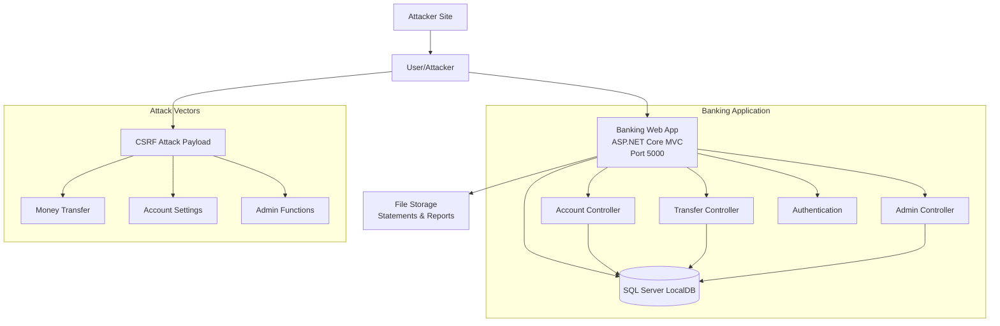

# Banking Application Architecture - Lab 04

## Overview

This lab implements a .NET Core MVC banking application that demonstrates Cross-Site Request Forgery (CSRF) vulnerabilities. The application simulates an online banking system with account management, transfers, and administrative functions.

## System Architecture



## Components

### 1. Web Application (ASP.NET Core MVC)
- **Technology**: .NET 8.0, Entity Framework Core
- **Purpose**: Banking portal with account management
- **Vulnerabilities**: 
  - CSRF in money transfers
  - CSRF in account settings changes
  - CSRF in administrative functions

### 2. Authentication System
- **Technology**: ASP.NET Identity
- **Features**: 
  - User registration and login
  - Role-based authorization (Customer, Admin)
  - Session management

### 3. Database Layer
- **Technology**: SQL Server LocalDB
- **Tables**:
  - AspNetUsers (Identity users)
  - Accounts (Bank accounts)
  - Transactions (Transaction history)
  - TransferRequests (Pending transfers)

### 4. Controllers

#### AccountController
- **Purpose**: Account management
- **Endpoints**:
  - `GET /Account/Dashboard` - Account overview
  - `POST /Account/UpdateProfile` - Update user profile (VULNERABLE)
  - `POST /Account/ChangePassword` - Change password (VULNERABLE)
  - `GET /Account/Statements` - Account statements

#### TransferController
- **Purpose**: Money transfers
- **Endpoints**:
  - `GET /Transfer/Index` - Transfer form
  - `POST /Transfer/Send` - Send money (VULNERABLE)
  - `POST /Transfer/Schedule` - Schedule transfer (VULNERABLE)
  - `GET /Transfer/History` - Transfer history

#### AdminController
- **Purpose**: Administrative functions
- **Endpoints**:
  - `GET /Admin/Dashboard` - Admin dashboard
  - `POST /Admin/CreateAccount` - Create account (VULNERABLE)
  - `POST /Admin/FreezeAccount` - Freeze account (VULNERABLE)
  - `POST /Admin/SetDailyLimit` - Set transfer limits (VULNERABLE)

## Security Issues

### CSRF Vulnerabilities

1. **Money Transfer CSRF**
   - Location: `POST /Transfer/Send`
   - Issue: No anti-forgery token validation
   - Impact: Unauthorized money transfers
   ```html
   <!-- Attacker's malicious page -->
   <form action="http://banking-app:5000/Transfer/Send" method="post">
     <input type="hidden" name="ToAccount" value="attacker-account" />
     <input type="hidden" name="Amount" value="1000" />
     <input type="submit" value="Click here for free gift!" />
   </form>
   ```

2. **Profile Update CSRF**
   - Location: `POST /Account/UpdateProfile`
   - Issue: Missing CSRF protection
   - Impact: Unauthorized profile changes, email updates
   ```html
   <form action="http://banking-app:5000/Account/UpdateProfile" method="post">
     <input type="hidden" name="Email" value="attacker@evil.com" />
     <input type="hidden" name="Phone" value="555-EVIL" />
   </form>
   ```

3. **Administrative CSRF**
   - Location: `POST /Admin/FreezeAccount`
   - Issue: Admin functions without CSRF protection
   - Impact: Unauthorized administrative actions

### Attack Scenarios

1. **Social Engineering + CSRF**
   - Attacker sends phishing email with malicious link
   - User clicks while logged into banking application
   - CSRF payload executes unauthorized transfer

2. **Malicious Website**
   - User visits attacker's website while logged in
   - Hidden form auto-submits CSRF attack
   - Banking application processes request as legitimate

3. **Image Tag CSRF**
   ```html
   
   ```

## Data Model

### User Account
```csharp
public class ApplicationUser : IdentityUser
{
    public string FirstName { get; set; }
    public string LastName { get; set; }
    public DateTime DateOfBirth { get; set; }
    public string SSN { get; set; }
    public decimal DailyTransferLimit { get; set; } = 5000;
}
```

### Bank Account
```csharp
public class BankAccount
{
    public int Id { get; set; }
    public string AccountNumber { get; set; }
    public string UserId { get; set; }
    public decimal Balance { get; set; }
    public string AccountType { get; set; }
    public bool IsActive { get; set; }
    public DateTime CreatedDate { get; set; }
}
```

### Transaction
```csharp
public class Transaction
{
    public int Id { get; set; }
    public string FromAccountId { get; set; }
    public string ToAccountId { get; set; }
    public decimal Amount { get; set; }
    public string Description { get; set; }
    public DateTime TransactionDate { get; set; }
    public TransactionStatus Status { get; set; }
}
```

## Security Assessment Points

1. **Anti-Forgery Token Usage**: Forms lack `@Html.AntiForgeryToken()`
2. **ValidateAntiForgeryToken Attribute**: Missing from vulnerable actions
3. **SameSite Cookie Settings**: Not configured properly
4. **Referrer Header Validation**: Not implemented
5. **CORS Configuration**: Overly permissive settings

## Network Security

- **Application Port**: 5000 (HTTP), 5001 (HTTPS)
- **Database**: Local SQL Server instance
- **File Storage**: Local file system for statements
- **Logging**: Event logs and file-based logging

## Deployment Considerations

- Runs in development mode with detailed error pages
- HTTPS redirection disabled for testing
- Anti-forgery validation disabled on vulnerable endpoints
- CORS configured to allow cross-origin requests
- Security headers not implemented

## Threat Model

### Assets
- User bank accounts and balances
- Transaction history
- Personal information (PII)
- Administrative controls

### Threats
- Unauthorized money transfers via CSRF
- Account takeover through profile updates
- Administrative privilege escalation
- Data exfiltration through CSRF chains

### Mitigations (Intentionally Not Implemented)
- Anti-forgery token validation
- SameSite cookie attributes
- Referrer header checking
- Custom CSRF validation middleware
- Multi-factor authentication for sensitive operations
